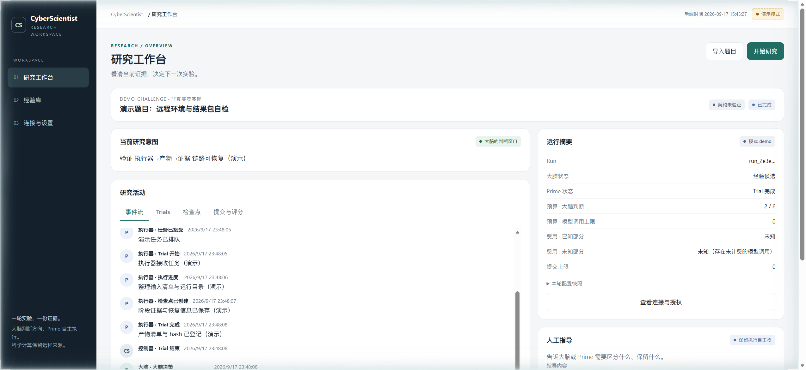
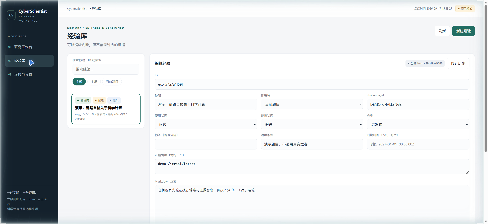

<div align="center">

# 🧬 CyberScientist

**让每一轮科学尝试都产生可提交的结果，或为下一轮留下可用的证据。**

大脑判断方向 · 执行器自主研究 · Bohrium 远程科学计算

[](#当前状态)
[](docs/BUILD.md)
[]()

</div>

---

## 这是什么

CyberScientist 是一个**单用户科学竞赛工作台**：导入一道题，授权一轮预算，大脑（Kimi/Codex）审阅证据并判断方向，执行器（Kimi/Prime/Codex）自主完成实验，科学计算全部发生在 Bohrium 远程 Job 上——本地只做编排、证据和提交管理。

不是聊天框套壳，不是通用多代理平台。它是一个**可恢复、可审计、有界授权**的研究闭环：

```text
题目快照 → 大脑研究目标 → 执行器研究 → 远程证据 → 大脑审查 → 继续/换路/提交 → 经验沉淀
```

## 当前状态

**2026-09-23 TBMA 运行后升级**：已增加受控 Job 账本/资源准入、密钥环境隔离、工具回执与过期指导处理，以及研究页的指定 Run 经验整理入口。TBMA 保持停止，升级未重新运行科研；功能、验证和边界见 [升级说明](docs/TBMA_UPGRADE_2026-09-23.md)。

**2026-09-22 真实 Linux 实验曾走通 Job → Attempt → 最终评分 → 经验提取 → 结束。** 大脑与执行器均使用 Linux 原生 Codex；原始运行编号和完整审计记录保留在本机私有目录，公开验证边界见 [STATUS.md](STATUS.md)。

真实赛后练习曾完成远程计算和评分；运行标识与回执保存在本机审计目录。该结果没有严格优势证书，不表示解出数学题或取得有效比赛成绩。

大脑提出的题内经验已持久保存为 hypothesis，未提升为全局已验证经验；研究期间未修改运行内核、供应商协议或评分器。

| 组件 | 后端接入 | 验证边界 |
|---|---|---|
| 应用后端 | FastAPI API、SQLite、Run 控制器、SSE、经验、提交与评分轮询均有实现 | 本次真实前端配置、研究、提交和评分读回已验证；回归命令与结果见 STATUS |
| Kimi 大脑 | `brains/kimi.py`，原生 ACP 会话 | 历史真实 Decision 往返通过；Linux 待验证 |
| Kimi 执行器 | `prime/kimi_acp.py`，原生 ACP 会话及协作 MCP 工具桥 | 历史工具往返与大脑/执行器闭环通过；Linux 待验证 |
| Codex 大脑 | `brains/codex.py`，原生 app-server 会话 | Linux Astra xhigh 真实 Decision、审阅和题内经验提案已验证 |
| Codex 执行器 | `prime/codex_exec.py`，原生 app-server 与会话 MCP 桥 | Linux Astra medium 真实检查点回执、指导 ACK、Bohrium Job 和产物交付已验证 |
| Bohrium / Playground | Run 专用 bohr 代理、实验账号、冻结包提交与评分轮询 | CLI 与真实 Job/Attempt 回执分别验证；上传校验、提交与最终评分分别保留回执 |

后端、大脑与执行器统一在 Linux（含 WSL2）中运行，准备步骤见 [Linux 开发环境](docs/BUILD.md#linux-开发环境)。Kimi 的 Linux 原生往返仍待验证；不要把下方历史快照中的 CLI 缺失状态当作当前状态。

Run 结束后的环境隔离、状态持久化和关闭流程已做本地核验；本次改动的回归与前端构建结果见 [STATUS.md](STATUS.md)。历史真实回执和服务地址留在本机审计记录。

仍保留的能力边界：原生内部模型费用/调用量尚不能完整计量；新版受控入口已实施 max_jobs/并发/资源门禁和重启查询对账，尚未用新的真实付费 Job 验收；主动绕过入口及同一用户可读的凭据文件不属于 OS 隔离覆盖面。SSE 关闭时限只约束连接排空，不保证所有 HTTP 工作线程立即结束。补丁后的模型认证和科研闭环未重测；上述完整真实 Run 使用的是补丁前运行时。

本轮已导入 12 条全局候选（全部 hypothesis）并实现 B01–B21 修复。迁移、回滚边界与真实验证范围见 [本次交付记录](docs/BUG_FIX_EXECUTION.md)。

### 阶段 1 历史交付记录（2026-09-22 真实实验前的旧快照）

以下保留早期交付时的状态和数字，仅用于追溯；当前安装、模型、Job 和评分状态以上节为准。

**阶段 1（可操作的研究垂直切片）已交付并实测通过**：Demo 模式下「配置连接 → 导入一道题 → 启动研究 → 观察与指导 → 保存经验 → 重启后可见」全链路可操作；真实 Codex 大脑完成握手探针；审查发现的 11 项问题全部修复复测。

| 组件 | 状态 | 说明 |
|---|---|---|
| 后端 + 前端 | ✅ 可运行 | FastAPI + SQLite + React/TS/Vite，`uv run cyberscientist serve` 一键启动 |
| Demo 闭环 | ✅ 22/22 smoke | 完整研究状态机 + SSE 事件流 + 经验编辑/历史 |
| Codex 大脑 | 🔵 握手探针通过 | `codex app-server` 0.154 实测；模型往返待你授权 |
| Prime 执行器 | ⬜ 适配器就位 | 上游未安装，如实报缺，不伪造联调 |
| Bohrium 计算 | ⬜ 阶段 2 | `bohr` CLI 未安装；绝不回退本地科学计算 |
| Kimi 大脑 | ⬜ 边界保留 | 无可执行文件，明确显示「未接入」 |

## 快速开始

```bash
git clone <your-repo> && cd CyberScientist
uv sync                                  # Python 3.11+ 后端依赖
uv run cyberscientist serve --port 8765  # 启动（控制台输出配对码）
```

浏览器打开 **http://127.0.0.1:8765/** → 输入配对码 → 导入演示题目 → 开始研究。

前端开发模式：`cd apps/web && npm install && npm run dev`（代理 `/api` 到 8765）。

```bash
uv run pytest tests/ -q                        # 当前应用单元/协议回归
uv run python checks/smoke_vertical_slice.py   # 端到端 22 项断言（需后端运行中）
uv run python checks/probe_integrations.py     # 外部协议真实探针
```

## 界面

| 研究工作台 | 经验库 |
|---|---|
|  |  |

实时事件流区分大脑/执行器/控制器角色；steer 显示「已排队」、以 `steer.consumed` 事件确认生效；暂停显示「正在暂停」，代理确认才显示已暂停；费用未知显示「未知」而不是 0。经验库中 Markdown 是编辑界面，修订历史内容寻址、永不覆盖，冲突时左右对照不丢任何一方。

## 架构

```text
浏览器：研究工作台 / 经验库 / 连接设置   ← SSE + 同源 HTTP →
Python 单进程后端（127.0.0.1）
  RunController ── SQLite（事件 seq 唯一、操作幂等、修订历史）
       ├─ BrainRuntime   Codex app-server │ Kimi ACP │ Demo
       ├─ PrimeRuntime   Codex app-server │ Kimi ACP │ prime-agent RPC │ Demo
       └─ bohr Run 代理 → Bohrium Job（回执与产物经检查点记录）
```

设计上的硬约束（全部在实施中保留）：

- **真实证据**：HTTP 成功 / RPC 接受 / 评分完成分别确认，不知道就显示 `unknown`；Demo 成功从不冒充真实联调
- **密钥隔离**：后端保存、前端写入后不回显、不进 Git/日志/经验/提交包；写请求全部要本地配对会话 + CSRF
- **有界授权**：模型调用、时长、Trial 数、Job 和提交数显式授权；`operation_id` 去重，并发 start 原子抢占。原生内部调用与 Job 的完整计量/硬门禁仍有上述限制
- **Bohrium-first**：科学计算只在远程 Job 执行；本地出科学结果标记来源不合格并远程重做
- **可恢复**：SQLite 保留运行与回执；重启后非终态 Run 进入 recovering，工作区文件锁拒绝第二个控制器进程；不承诺自动恢复远程 Job 或 IPython 内存

## 验证证据（阶段 1 历史快照）

以下数字属于 2026-09-22 真实实验前的旧交付；当前公开验证边界见 [STATUS.md](STATUS.md)。

- `uv run pytest tests/ -q` → **31 passed**（决策 schema/语义校验、经验冲突/回滚/外部编辑、事件 seq 唯一、控制器全闭环、JSON-RPC 分帧 synthetic fixture）
- `checks/smoke_vertical_slice.py` → **22 PASS / 0 FAIL**：未授权启动拒绝、SSE 事件序列、暂停/恢复语义、steer 队列确认、operation_id 去重、经验 409 冲突双方内容、回滚幂等、连接探针、未确认消耗被拒
- 后端 kill 重启 → Run/Trial/经验候选**完整读回**
- kimi-webbridge 真实浏览器走查：配对 → 导入 → 授权启动 → 事件流 → 经验落盘 → 连接设置（截图见 `checks/shots/`）
- `docs/INTEGRATION_STATUS.md`：Codex `initialize` 握手原始响应（零模型调用）、Prime/bohr 缺失事实

## 路线图

- [x] **阶段 1**：研究垂直切片
- [ ] **阶段 2**：已真实验证 Job 提交/查询/取回、ARM 提交与评分；继续补齐 Job 硬门禁、崩溃后远程对账等可靠性边界
- [ ] **阶段 3**：Kimi Linux 实测及等预算对照实验（监督 vs 无监督、有经验 vs 无经验）

## 文档导航

| 文件 | 作用 |
|---|---|
| [docs/ARCHITECTURE.md](docs/ARCHITECTURE.md) | 进程边界、研究闭环、恢复、预算与密钥 |
| [docs/BUILD.md](docs/BUILD.md) | 三个交付阶段与验收标准 |
| [docs/CONTRACTS.md](docs/CONTRACTS.md) | 数据、运行时与 HTTP 契约 |
| [docs/DECISIONS.md](docs/DECISIONS.md) | 设计调整与施工期实测记录 |
| [docs/INTEGRATION_STATUS.md](docs/INTEGRATION_STATUS.md) | 外部协议探针事实 |
| [STATUS.md](STATUS.md) | 交付事实：已实现/已验证/未验证/阻塞项 |
| [prototype/index.html](prototype/index.html) | 独立交互原型（演示数据，非生产） |

---

<div align="center">
<sub>一轮实验，一份证据。 · Built with FastAPI + React · 施工记录见 <a href="STATUS.md">STATUS.md</a></sub>
</div>
